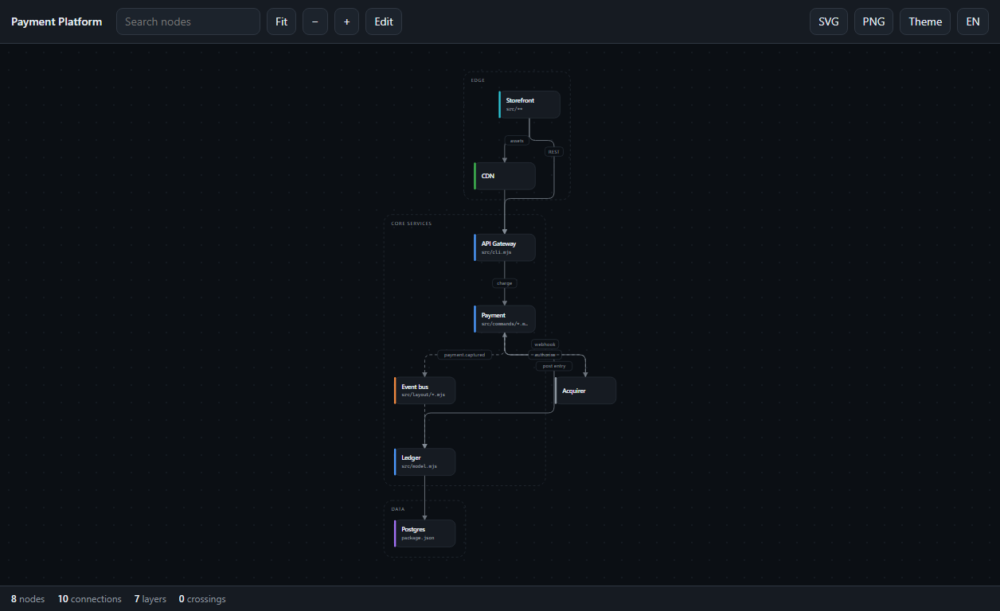
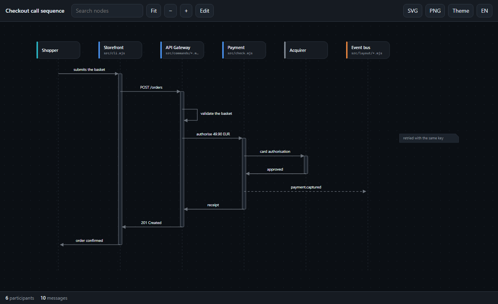
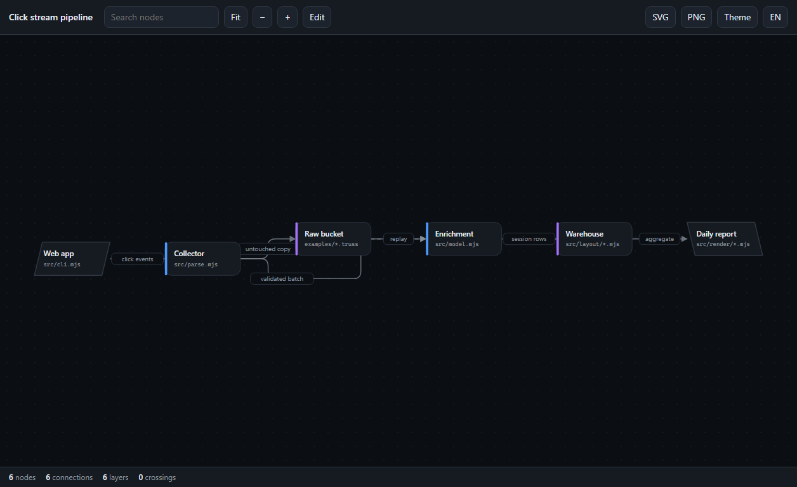
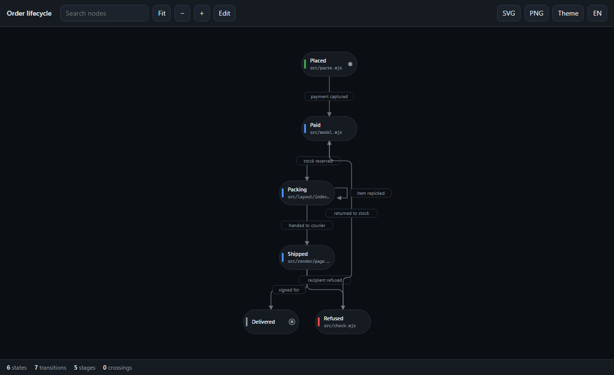
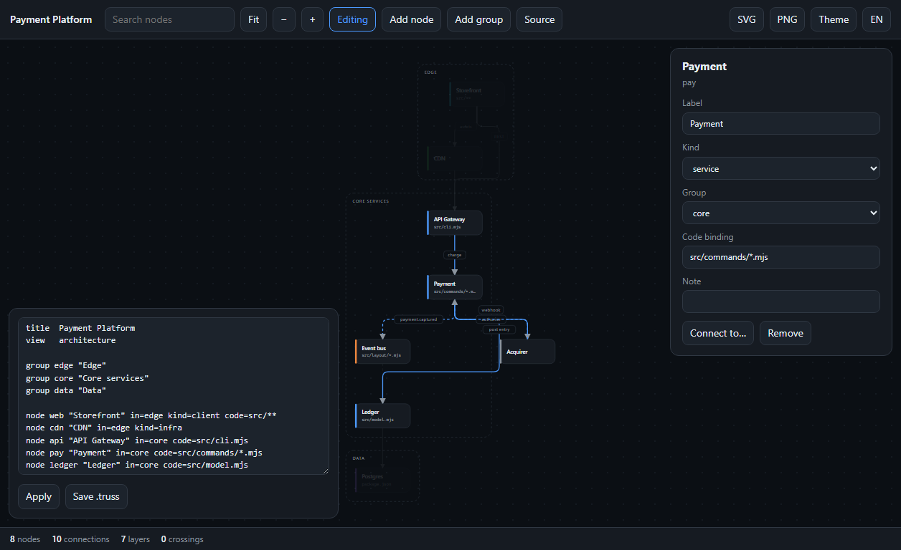

# tlk-truss

Architecture diagrams bound to real code.

[](https://github.com/Talkdedsec/tlk-truss/actions/workflows/ci.yml)

Every diagram-as-code tool turns text into a picture. None of them can tell you when the picture
started lying. `truss` binds each node to a path in the repository and fails your build when that
path is gone.

```
$ truss check docs/architecture.truss --ci
✗ docs/architecture.truss:14  E400  "ledger" is bound to src/ledger/**, which matches nothing
1 binding(s) no longer resolve
$ echo $?
1
```

Turkish: [README.tr.md](README.tr.md)

## Status

v0.1 work in progress, feature complete and tested: four views, the measured layout engine, the
single-file HTML output with live editing, the drift gate, exporters and Mermaid import. What is
left is packaging — CI, the published demo and the npm release.

## What it looks like

| Architecture | Sequence |
|---|---|
|  |  |

| Data flow | Lifecycle |
|---|---|
|  |  |

Edit mode, with the live source next to the drawing:



## Install

Node 20 or newer, no runtime dependencies.

```
npm install -g @talkdedsec/tlk-truss
```

Or run it straight from the checkout:

```
node bin/truss.mjs draw examples/payments.truss
```

## The source

```
title  Payment Platform
flow   down

group edge "Edge"
group core "Core services"

node web    "Storefront"  in=edge kind=client  code=apps/web/**
node api    "API Gateway" in=core kind=service code=services/api/**
node pay    "Payment"     in=core kind=service code=services/payment/**
node bus    "Event bus"   in=core kind=queue
node bank   "Acquirer"            kind=external note="third party"

web -> api : REST
api -> pay : charge
pay ~> bus : payment.captured
pay -> bank : authorise
```

- `view` is one of `architecture`, `sequence`, `dataflow`, `lifecycle`
- `->` a call, `~>` an asynchronous message
- `:` after a connection carries its label
- `kind=` is one of `service`, `store`, `queue`, `infra`, `client`, `external`, `job`
- `code=` is the binding: a path or a glob, several separated by commas
- `note=` hangs a note off a node, or off a message in a sequence:
  `api -> pay : "charge" note="idempotent"`
- `#` starts a comment

Every keyword also has a Turkish spelling (`baslik`, `grup`, `dugum`, `icinde=`, `tur=`, `kod=`),
and the two can be mixed in one file.

## The four views

| `view` | What it draws | What changes |
|---|---|---|
| `architecture` | services, stores, boundaries | grouped boxes, layered top to bottom |
| `sequence` | one run, message by message | lifelines, activation bars, notes, self calls |
| `dataflow` | a pipeline | left to right, sources and sinks drawn slanted |
| `lifecycle` | a state machine | pills, a start dot, an end ring, self transitions as loops |

The first three share one layout engine; the sequence view has its own. A state may point at
itself, and in a sequence the same pair may talk twice — the rules follow the view.

## Commands

```
truss draw   <source.truss> [-o out.html]   render a single-file HTML diagram
truss check  <source.truss> [--root .]      verify every code binding still resolves
truss export <source.truss> --to svg|dot|mermaid|json
truss import <diagram.mmd>                  convert Mermaid into a .truss source
truss watch  <source.truss> [--serve]       redraw on every save
```

`watch` rewrites the page whenever the source changes and prints the new numbers. With `--serve`
it also puts the page on `127.0.0.1:4173` and reloads your browser on each save; the reload snippet
lives only in the served copy, never in the file on disk.

`import` reads Mermaid `flowchart`, `sequenceDiagram` and `stateDiagram` sources, keeps subgraphs,
shapes, arrow styles and edge labels, and writes a source you can check into the repository.

Both take `--lang en|tr`, `--json` and `--ci`. `check` exits 1 when a binding no longer resolves,
which is all a CI job needs:

```yaml
- run: npx @talkdedsec/tlk-truss check docs/architecture.truss --ci
```

Add `--strict` to also flag nodes that carry no binding at all, and `--uncovered` to turn the
question around: which directories does no diagram claim? Several sources can be checked together,
and the coverage is their union.

```
$ truss check docs/*.truss --root . --uncovered
! /srv/shop  W401  no node claims "workers/"
✓ every code binding resolves — 21/26 nodes bound to code
```

## The drawing

One HTML file, no network calls, no build step. Dark and light themes, pan and zoom, search,
a detail panel per node showing its binding, and SVG/PNG export. It reports what it did rather than
claiming it looks good: node count, connection count, layer count and the measured number of edge
crossings sit in the footer.

Nothing is frozen. Press **Edit** and the page becomes an editor: rename a node, change its kind,
group or code binding, add or remove nodes, connections and groups. Every change re-runs the whole engine —
which ships inside the page — and the diagram is laid out again in front of you. **Source** shows
the `.truss` text as you edit, takes a paste back, and saves the file. A change that would not
parse is refused with its diagnostic code and the drawing is left alone.

The layout is automatic and always is: cycles are broken, layers assigned, order chosen by the
median heuristic, crossings counted with a Fenwick tree, coordinates relaxed towards straight lines,
and group boxes pushed clear of nodes that do not belong to them. There are no manual coordinates in
the source language, because a diagram you have to hand-place is a diagram nobody updates.

## Licence

PolyForm Noncommercial 1.0.0 — free to use, not to sell. See [LICENSE](LICENSE).
